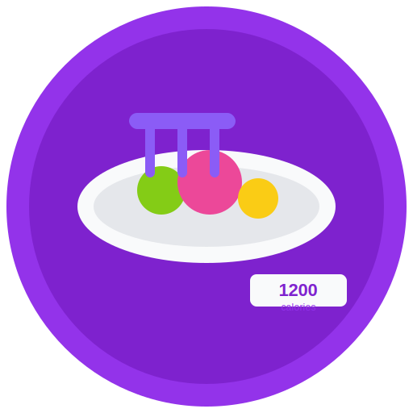

# CalorieWatcher

<div align="center">
  
</div>

CalorieWatcher is a modern, user-friendly nutrition tracking application built with Next.js, React, and TypeScript. It helps users monitor their daily calorie intake, track macronutrients, and maintain healthy eating habits.

## Features

- 🔐 **Secure Authentication**: Sign in with Google to save your data across devices
- 📊 **Comprehensive Dashboard**: View your nutrition data with interactive charts
- 🍽️ **Meal Tracking**: Log meals with detailed nutritional information
- 🎯 **Goal Setting**: Set and track daily calorie and macronutrient goals
- 🌐 **Multilingual Support**: Available in English, Thai, Japanese, and Chinese
- 🌙 **Theme Support**: Features light and dark themes
- 📱 **Responsive Design**: Optimized for both desktop and mobile use

## Getting Started

### Prerequisites

- Node.js 18.x or higher
- npm or yarn

### Installation

1. Clone the repository
```bash
git clone https://github.com/yourusername/caloriewatcher.git
cd caloriewatcher
```

2. Install dependencies
```bash
npm install
# or
yarn install
```

3. Set up environment variables
Create a `.env.local` file in the root directory and add the following:
```
NEXTAUTH_URL=http://localhost:3000
NEXTAUTH_SECRET=your-secret-key
GOOGLE_CLIENT_ID=your-google-client-id
GOOGLE_CLIENT_SECRET=your-google-client-secret
MONGODB_URI=your-mongodb-connection-string
```

4. Run the development server
```bash
npm run dev
# or
yarn dev
```

5. Open [http://localhost:3000](http://localhost:3000) with your browser to see the result.

## Tech Stack

- **Framework**: Next.js 14
- **Language**: TypeScript
- **Styling**: Tailwind CSS
- **Authentication**: NextAuth.js with Google provider
- **State Management**: Zustand
- **Charts**: Recharts
- **UI Components**: Shadcn UI
- **Database**: MongoDB (optional)

## Project Structure

```
/app                  # App router pages and layouts
  /(main)             # Authenticated routes
  /api                # API routes
  /auth               # Authentication pages
/components           # Reusable UI components
  /providers          # Context providers
  /ui                 # UI component library
/lib                  # Utility functions and libraries
  /store              # Zustand stores
  /models             # Data models
/public               # Static assets
```

## Customization

### Theme Customization

Edit the `globals.css` file to customize the colors for light and dark themes. The application uses CSS variables within the `:root` and `.dark` selectors.

### Adding a New Language

Add a new locale to the translations objects in various components and to the `i18n` configuration in `app/layout.tsx`.

## License

This project is licensed under the MIT License - see the LICENSE file for details.

## Acknowledgements

- [Next.js](https://nextjs.org/)
- [Tailwind CSS](https://tailwindcss.com/)
- [Shadcn UI](https://ui.shadcn.com/)
- [Zustand](https://github.com/pmndrs/zustand)
- [NextAuth.js](https://next-auth.js.org/)
- [Recharts](https://recharts.org/)
